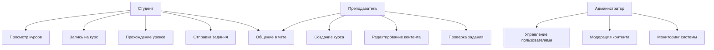
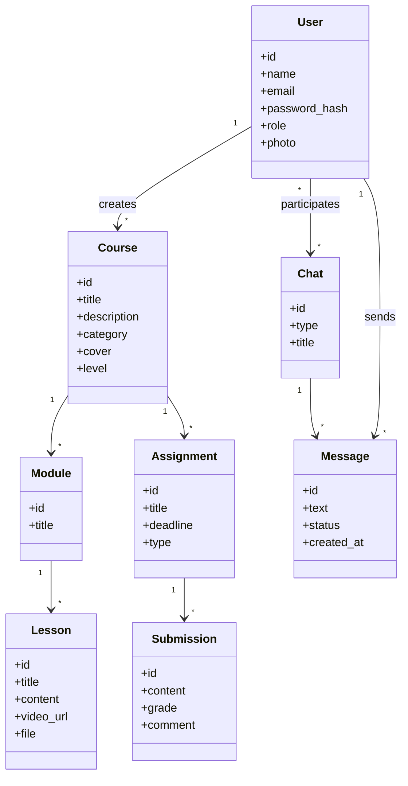
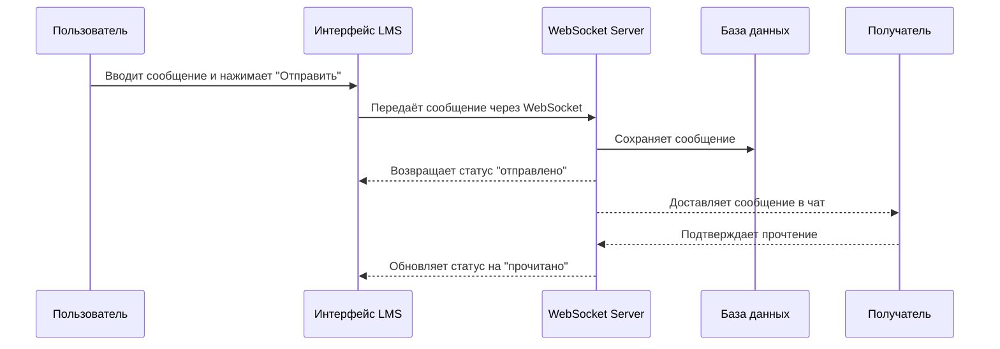
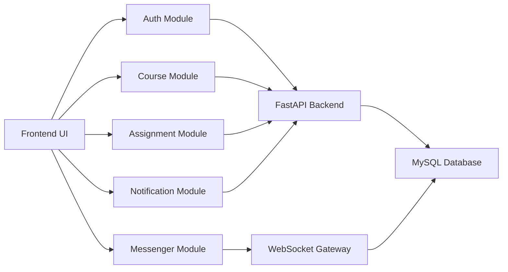

# EduFlow LMS

EduFlow LMS - это демонстрационный проект веб-платформы для онлайн-обучения со встроенным мессенджером. Проект можно открыть локально без сборки: достаточно запустить файл `index.html` в браузере.

## Что реализовано

- роли пользователей: `student`, `teacher`, `admin`
- каталог курсов с фильтрацией по категории и уровню
- структура курса: модули и уроки
- блок заданий и мини-тест с автопроверкой
- отслеживание прогресса и уведомления
- профиль пользователя и административная панель
- интегрированный мессенджер:
  - личные чаты
  - групповые чаты курса
  - административный канал
  - статусы сообщений
  - индикатор набора текста
  - поиск по чатам
  - отправка сообщений и файлов в demo-режиме

## Стек технологий

### Frontend

- HTML
- CSS
- JavaScript

### Backend для полной версии

- FastAPI
- MySQL
- SQLAlchemy
- WebSocket

## Предлагаемая структура backend-версии

```text
eduflow-lms/
├── backend/
│   ├── app/
│   │   ├── core/
│   │   ├── routers/
│   │   ├── schemas/
│   │   ├── data.py
│   │   └── main.py
│   └── requirements.txt
├── static/
└── frontend files
```

## Основные сущности системы

- `User`: общая модель пользователя
- `StudentProfile`, `TeacherProfile`, `AdminProfile`
- `Course`: курс
- `Category`: категория курса
- `Module`: модуль курса
- `Lesson`: урок
- `Assignment`: задание
- `Submission`: решение студента
- `Quiz`, `Question`, `AnswerOption`
- `Enrollment`: запись студента на курс
- `Progress`: прогресс по курсу
- `Chat`: чат
- `ChatParticipant`: участник чата
- `Message`: сообщение
- `Notification`: уведомление

## Use Case Diagram



## Class Diagram



## Sequence Diagram: Отправка сообщения



## Component Diagram



## Что можно сделать следующим этапом

- реализовать регистрацию и авторизацию
- добавить миграции Alembic и `.env`-конфигурацию
- подключить полноценный WebSocket-чат
- сделать загрузку файлов и хранение медиа
- вынести админ-панель в отдельный раздел
